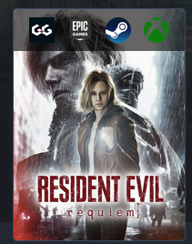
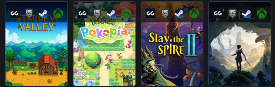

# Backloggd Quick Storefront Links

Adds a row of quick storefront **search** links to games on [Backloggd](https://backloggd.com), so you can jump from a game to its listing on each store in one click.

Each link is a favicon that searches the game's title on:

- [GG.deals](https://gg.deals) (price comparison)
- [Epic Games Store](https://store.epicgames.com)
- [Steam](https://store.steampowered.com)
- [Xbox](https://www.xbox.com) (filtered to Game Pass)

## Install

Open [backloggd-quick-storefront-links.user.js](./backloggd-quick-storefront-links.user.js), click **Raw**, and your userscript manager ([Tampermonkey](https://www.tampermonkey.net/) / [Violentmonkey](https://violentmonkey.github.io/)) will offer to install it.

Runs on `https://backloggd.com/*`. No external libraries required.

## Where the links appear

- **Game pages**: a row of larger (24px) icons is overlaid across the top of the main cover.



- **List/collection pages**: a row of smaller (16px) icons is overlaid across the top of each game's cover.



## How it works

- The game name is read from the card's caption (`.game-text-centered`), which is always present in the server HTML, falling back to the cover image's `alt` or the page heading. `getLinksByGame(name)` then builds the per-store search URLs, URL-encoding the title so games with special characters work.
- Links are built as real DOM elements (not HTML strings), so titles with spaces or symbols can't break attributes.
- Backloggd is a single-page app that re-renders the game list on pagination, which can wipe the overlay. To handle this it uses, together: a debounced `MutationObserver`, the `navigatesuccess` event, and a 1-second interval safety net. Idempotency is based on whether the overlay already exists in the cover (tagged with `data-game`), so re-runs never duplicate, recover the overlay if a re-render removes it, and rebuild it if a card is recycled for a different game.

## Customizing the stores

Edit the array returned by `getLinksByGame` near the top of the script. Each entry is:

```js
{
  href:   `https://example.com/search?q=${query}`, // query is the encoded game name
  domain: "example.com",                            // used for the favicon icon
  alt:    "Example Store",                          // tooltip / alt text
}
```

## Notes

- These are **search** links, not direct game pages. The store's top result is usually the game, but not guaranteed.
- If Backloggd changes its markup, update the selectors (`div.game-cover`, `.overflow-wrapper`, `.game-text-centered`, `div.game-title-section h1`) in the script.
