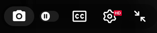

# YouTube Macros

Keyboard macros and a screenshot button for the YouTube watch page.

## Install

Open [youtube-macros.user.js](./youtube-macros.user.js), click **Raw**, and your userscript manager ([Tampermonkey](https://www.tampermonkey.net/) / [Violentmonkey](https://violentmonkey.github.io/)) will offer to install it. No external libraries required.

## Features

### Keyboard shortcuts

Press these keys while on a YouTube page:

| Key     | Action                                                        |
| ------- | ------------------------------------------------------------- |
| `*`     | Step playback speed **up** to the next value                  |
| `/`     | Step playback speed **down** to the previous value            |
| `-`     | Download the current video frame                              |
| `` ` `` | Toggle hiding the player chrome (for a clean fullscreen view) |

### Screenshot button

A camera button is added to the player control bar (next to Settings). Clicking it downloads the current frame — the same action as pressing `-`.

## Details

- **Playback speed** cycles through `SPEEDS = [0.5, 1, 1.5, 2]` (edit the array near the top of the script to change it). Speeds are applied via YouTube's player API so the on-screen speed UI stays in sync. The API only honors its supported rates (`0.25`–`2` in `0.25` steps), so keep custom values within that range.
- **Screenshots** are captured straight from the decoded video frame via `<canvas>.drawImage` at the video's native resolution — instant, with no page freeze. Files are named `<video title> <H-MM-SS>.png` using the title and current timestamp.
- **Fullscreen cleanup** hides overlay/chrome elements by class name. If YouTube changes its markup, update `HIDDEN_CLASSES` near the top of the script.

## Notes

- Screenshots fail (logged to the console) only if a stream is DRM-protected, which taints the canvas. Regular videos are fine.
- The script re-injects the control-bar button if YouTube rebuilds its controls, so it survives in-page navigation.
